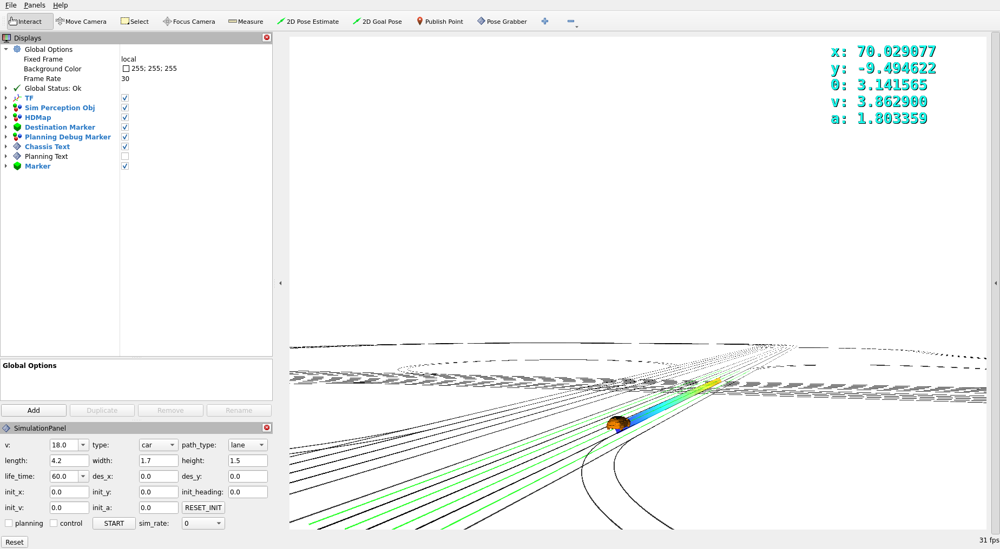

# XJU AUTOPILOT



XJU-AUTOPILOT is an autonomous driving framework built on ROS2 Iron Docker. This framework currently focuses primarily on **decision-making** and **planning** module, while other modules such as perception, prediction, and control are implemented through **simulation**. We provide Docker images and code for relevant practitioners to study and use.

**Table of Contents**
- [Installation](#installation)
- [Getting Started](#getting-started)
- [License](#license)
- [Citation](#citation)

## Installation

[Install VS Code and Docker](https://docs.ros.org/en/humble/How-To-Guides/Setup-ROS-2-with-VSCode-and-Docker-Container.html#install-vs-code-and-docker)

---

```bash
# Download code and make cache directory
git clone https://github.com/Mr-Tony921/xju-autopilot.git
mkdir cache/iron && cd cache/iron && mkdir build log install && cd ../..
```

Open directory in VS Code, then reopen in remote container, downloading and compiling docker image may take some time.

```bash
# Test environment
source /opt/ros/iron/setup.bash
rviz2
```

## Getting Started

```bash
# Basic example of how to build and run
colcon build
./src/pnc/script/simulation.sh
```

## License

All resources in XJU-AUTOPILOT are licensed under fully permissive licenses (e.g., Apache-2.0).

## Citation

If you use XJU-AUTOPILOT or docker image, consider citing the following publication:

```
@inproceedings{tony2024xju-autopilot,
  title={xju-autopilot: An Autonomous Driving Framework},
  author={Tony},
  url={https://github.com/Mr-Tony921/xju-autopilot.git},
  year={2024}
}
```
